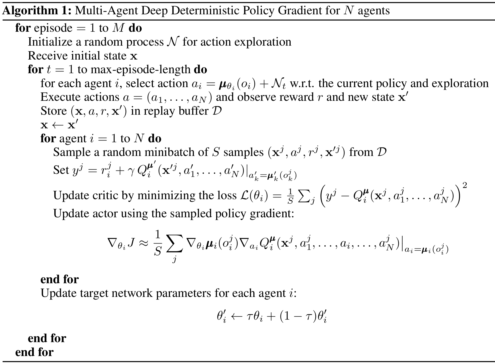

# Collaboration and Competition with Reinforcement Learning
In this directory two agents will be trained to play tennis against each other
The structure is the following:
* [Tennis.app](Tennis.app) is the modified Unity environment
* [saved_models](saved_models) contains the saved weights of the critic and actor networks
* [tennis.yml](tennis.yml) is the config-file for the anaconda environment
* [collaborate_and_compete_tennis.ipynb](collaborate_and_compete_tennis.ipynb) is the jupyter notebook for the solution of the tennis environment with two agents
* [agent.py](agent.py) includes the replay buffer, exploration noise and the agents
* [model.py](model.py) defines the network architecture of the neural networks

## Set up the Conda Environment

1. Install [Anaconda](https://www.anaconda.com/)
2. Navigate to this directory
3. Set up the conda environment with `conda env create -f tennis.yml`
4. Activate the conda environment with `conda activate tennis`
5. INFORMATION ONLY FOR DEACTIVATING: `conda deactivate`

## Learning Algorithm
The Multi-Agent DDPG algorithm was published by OpenAI and UC Berkeley (Lowe et al.) "[Multi-Agent Actor-Critic for Mixed Cooperative-Competitive Environments](https://arxiv.org/pdf/1706.02275.pdf)". It lets the agents train in a collaborative and/or competitive fashing, as they try to maximize the joint Q-value. In the tennis environment the behavior can be observed by each agent trying individually to find the best policy to hit the ball, but both agents trying together to play as long as possible.  Both agents have a shared replay buffer, but only learn from their own experiences. Each agent learns his or her own policy, with the Critic making a statement about how they both perform together. Since the DDPG algorithm is used in the background, an exploration noise must also be used here. Batch normalization was used for regularization.

## Network Architecture
### Actor
The network architecture for the actors is structured as follows:
* Input Layer:
    - Input: State of the Agent
    - Output: State of the Agent
    - Activation Function: None
    - Weight Initialization: None
    - Normalization: None
* First Hidden Layer:
    - Input: Output of the Input Layer
    - Output: 400 Neurons
    - Activation Function: ReLU
    - Weight Initialization: Variance Scaling (FAN-IN)
    - Normalization: Batch Normalization
* Second Hidden Layer:
    - Input: Output of the First Hidden Layer
    - Output: 300 Neurons
    - Activation Function: ReLU
    - Weight Initialization: Variance Scaling (FAN-IN)
    - Normalization: None
* Output Layer:
    - Input: Output of the Second Hidden Layer
    - Output: 1
    - Activation Function: tanh (tangens hyperbolic)
    - Weight Initialization: Uniform Distributed from -0.003 to 0.003
    - Normalization: None

### Critic
The network architecture for the critics is structured as follows:
* Input Layer:
    - Input: State and actions of the Agent
    - Output: State of the Agent
    - Activation Function: None
    - Weight Initialization: None
    - Normalization: None
* First Hidden Layer:
    - Input: Output of the Input Layer
    - Output: 400 Neurons
    - Activation Function: ReLU
    - Weight Initialization: Variance Scaling (FAN-IN)
    - Normalization: Batch Normalization
* Second Hidden Layer:
    - Input: Output of the First Hidden Layer
    - Output: 300 Neurons
    - Activation Function: ReLU
    - Weight Initialization: Variance Scaling (FAN-IN)
    - Normalization: None
* Output Layer:
    - Input: Output of the Second Hidden Layer
    - Output: 1
    - Activation Function: Linear
    - Weight Initialization: Uniform Distributed from -0.003 to 0.003 (can be also Variance Scaling FAN-IN)
    - Normalization: None

### Target & Online Networks
For the learning process it is necessary to know the temporal difference error (TD-Error) between true and predicted Q-value (output of the critic). However, since it is not known what the true TD target is, it must be estimated and for this estimation the Bellman equation is used, which takes the reward of the action + the highest Q-value of the next state. If, however, the estimation of the Q-value changes during the training phase, only the optimal TD goal can be chased, but not achieved. To avoid this, two Actor and two Critic networks are set up. The first network of both is used for online prediction of the outputs, while the second network of both is used as the target network. This helps to ensure that the TD target does not fluctuate all the time but is available for the online networks for a certain period of time.
There are two ways to update the target networks:
* Hard-Update: All weights from the target network will be assigned identically with the weights from the online network
* Soft-Update: A fraction of the weights from the online network will be added to the weights from the target network
